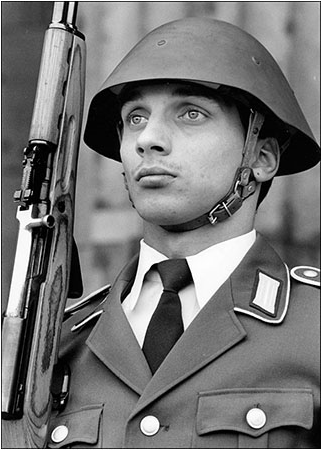
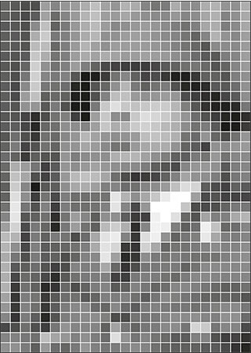
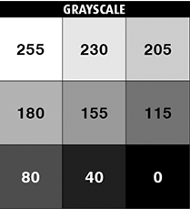
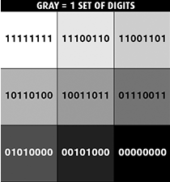
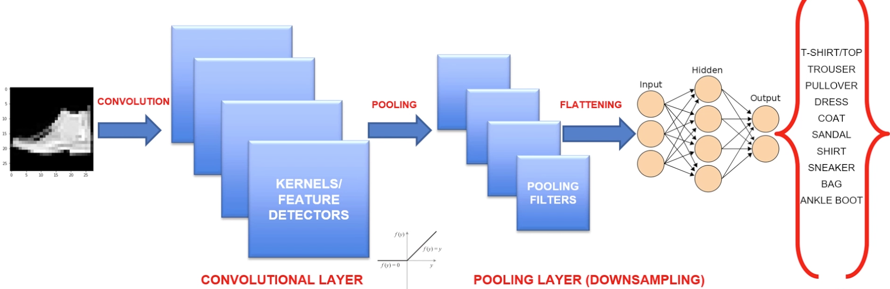
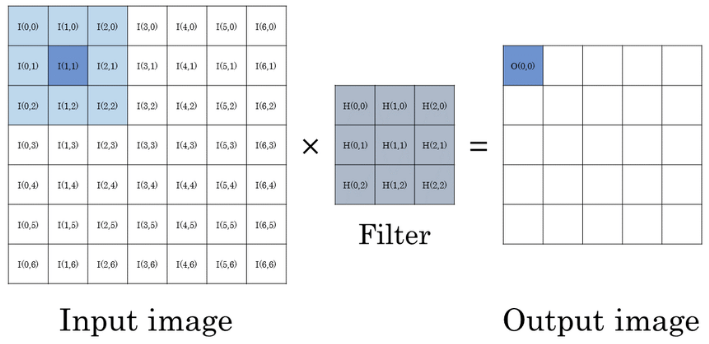
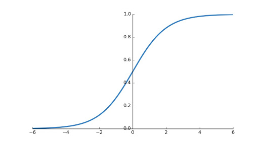
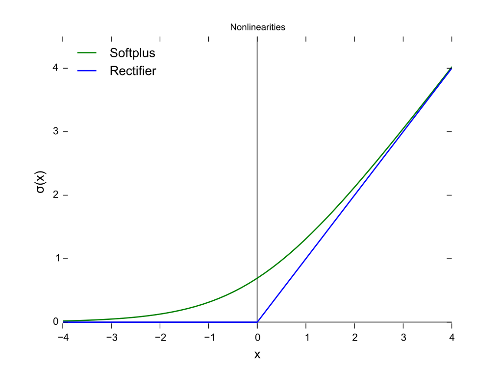

# Fashion Class Classification

The global fashion industry is valued at $3 trillion and accounts for 2% of the worlds GDP. The fashion industry is undergoing a dramatic transformation by adopting Machine Learning, Deep Learning and Computer Vision techniques.

**Amazon Echo Look:** https://www.youtube.com/watch?v=9X_fP4pPWPw

**Task:** We have been hired by a fashion retailer who uses Machines Learning techniques to analyse the types of clothing invdividuals wear in their instagram pictures. This data is then used to recommend the best outifts and clothing to purchase (targetted marketing) that are inline with fashion trends. 

The fashion dataset consists of 70,000 images divided into 60,000 training and 10,000 test samples. The dataset consists of 28x28 grayscale images, each image being represented by a row with 748 columns associated with a label from 10 classes.

The 10 target classes are as follows:

- T-shirt/top
- Trouser
- Pullover
- Dress
- Coat
- Sandal
- Shirt
- Sneaker
- Bag
- Ankle boot

Each image is 28 pixels in height and 28 pixels in width, for a total of 784 pixels. Each pixel has a single pixel-value associated with it, indicating the lightness or darkness of that pixel, with higher numbers meaning lighter. This pixel-value is an integer between 0 and 255

# Convolution Neural Networks

## What is an image? 

- Images are stored within the computer as numbers only.
- '0' represents black and '255' represents white.
- All numbers in between represent greys between black and white.
- Binary systems use digits '0' and '1', where '00000000' is black and '11111111' is white (8-bit image).
- **Note:** The binary value of '11111111' is equal to the decimal value of '255'.
- Converting binary values to decimal values: https://www.wikihow.com/Convert-from-Binary-to-Decimal

   

**Image Source:** http://shutha.org/node/789

## Artificial Neural Networks

Please see the following: https://github.com/MohitGoel92/Will-the-customer-leave-the-bank-

### Using Artificial Neural Networks For Image Processing

Our objective here is to train the ANN to classify images (the input) by learning from the images, changing the weights accordingly and classifying them correctly (the output). However, we cannot treat images like the features of a dataset and simply input the rows of pixels into the ANN. This is because we need to preserve the spatial dependence between pixels. We must therefore perform a process before we feed our pixels directly to our network, this is called 'Convolution'. This is where the term 'Convolution Neural Network' comes from.

The image below shows an overview of the Convolution Neural Network we will use.

**Image Source:** https://www.udemy.com/course/machine-learning-practical/learn/lecture/11789814#overview

### Convolution Neural Network - Feature Detection

- Convolutions use a kernel matrix to scan a given image and apply a filter to obtain a certain effect.
- An image Kernel is a matrix used to apply effects such as blurring (averaging the pixels) and sharpening.
- Kernels are used in machine learning for 'Feature Extraction' to select the most important pixels of an image.
- Convolution preserves the spatial relationship between pixels using a 'Feature Map.

For a more in depth explanation and live convolution see: https://setosa.io/ev/image-kernels/

The diagram below shows the input image, the filter (feature detector) and output image (feature map).

**Image Source:** https://www.researchgate.net/figure/Image-convolution-with-an-input-image-of-size-7-7-and-a-filter-kernel-of-size-3-3_fig1_318849314

### Convolution Neural Network - ReLU (Rectified Linear Units)

- ReLU layers are used to add non-linearity in the feature map.
- It also enhances the sparsity or how scattered the feature map is.
- The gradient of the ReLU does not vanish as we increase X compared to the sigmoid function.

The diagram below shows the sigmoid function:

**Image Source:** http://ronny.rest/blog/post_2017_08_10_sigmoid/

**Image Source:** https://en.wikipedia.org/wiki/Rectifier_(neural_networks)#/media/File:Rectifier_and_softplus_functions.svg

Please see the following: https://github.com/MohitGoel92/Is-it-a-cat-or-a-dog
